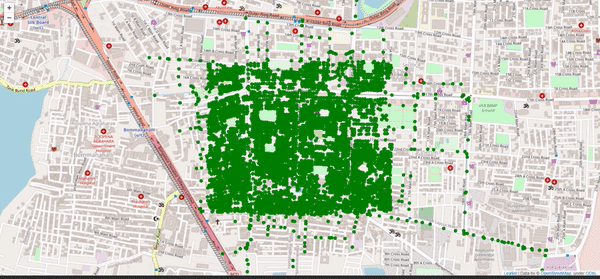

# Dijkstra's Algorithm on Maps

This project aims to apply Dijkstra's algorithm to a real world scenario - generating directions from point A to point B on the map of a city. This means, that the algorithm must now account for buildings, road blocks, permitted movement directions on a road and accordingly find the shortest path.

In order to generate this algorithm, we need to use a map. For our example, we use an area of Bangalore, India and has been extracted from OpenStreetMap. 

We then create a graph based on nodes of the map. A node is simply a point on the map that is a part of the road and not obstructed by a building. We then connect all nodes that can be reached by each other that do not go through a building, ie, all connections between nodes signify a part of a road. These connections also have to be directionally accurate so as to adhere to the laws of the city. This would give us the most real world estimate of the shortest path a user can take to get from point A to point B.

___
## Demo

  
Green Dot -     Nodes on the map  
Blue Dot -      Source node  
Blue Tag -      Destination node  
Blue Dashes -   Shortest path      

___  
## Project Details

Maps - Downloaded from OpenStreetMap, a free-to-use service.
       It is present as a .osm file in the Maps folder.
       
Algorithm - Dijkstra's Algorithm gives us the shortest path between points.
            The graph is stored as an adjacency matrix between points on the map.
___
## Functioning

When Compiled the map is analysed and all the nodes are stored in a list.  
Then an adjacency matrix of node x node is generated and mapped.  
In this at first all the nodes are assumed start point and a path to other nodes are generated.  

Then we ask user for the source node using a map automatically opened in a browser.  
  
(Nodes are in green dots)  

After that a multiple destination nodes are displayed to the user in the browser.  

(Blue dot is the source and red dots are the possible destination)  

After the user selects a destination, the shortest path is displayed in the map.  

The whole process is running in the console when the .py file is compiled.  
